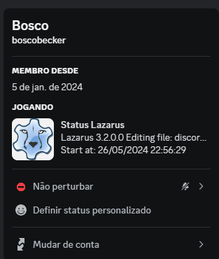
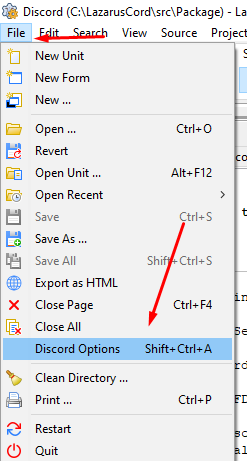

# 🎮 Discord Rich Presence Extension for Lazarus

## 📖 Description
This extension integrates Discord Rich Presence with the Lazarus IDE, showing what you're editing in Lazarus on your Discord profile.

## ✨ Features
* 📂 Displays the currently edited file name.
* 🌐 Detects file extension and shows the corresponding language icon (see `extensions.pas` for supported extensions).

The most up-to-date documentation for Rich Presence can always be found on our [developer site](https://discordapp.com/developers/docs/rich-presence/how-to)! 
If you're interested in implementing Rich Presence via IPC sockets instead of using our SDK, check out the ["Hard Mode" documentation](https://github.com/discordapp/discord-rpc/blob/master/documentation/hard-mode.md).

## 🛠️ Basic Usage
First, head over to the [Discord developers site](https://discordapp.com/developers/applications/me) and create an app. Keep track of your `Client ID`—you'll need it to pass to the initialization function.

### 💾 Installation
Download and extract to a folder of your choice.

✈ Where is it once installed?

### 📂 Folders / 🚨 See the folder permission

- `/discord-rpc/windows` - Contains Discord RPC `.dll`.
- `/discord-rpc/linux` - Contains Discord RPC `.so`.
- `/src/package` - Plugin for the IDE.
- `/src/source` - Abstraction to call dynamic libraries in `DiscordRPC.pas`.
- `/bin` - Output for the various binaries, once compiled.

External source for Discord RPC: [discord-rpc](https://github.com/discord/discord-rpc).

## 💬 Contributions / Ideas / Bug Fixes
To submit a pull request, follow these steps:

1. 🍴 Fork the project.
2. 🌿 Create a new branch (`git checkout -b my-new-feature`).
3. 🛠️ Make your changes.
4. 💾 Commit your changes (`git commit -am 'Add new feature or fix bug'`).
5. 📤 Push the branch (`git push origin my-new-feature`).
6. 🔄 Open a pull request.

Give us a Star.
